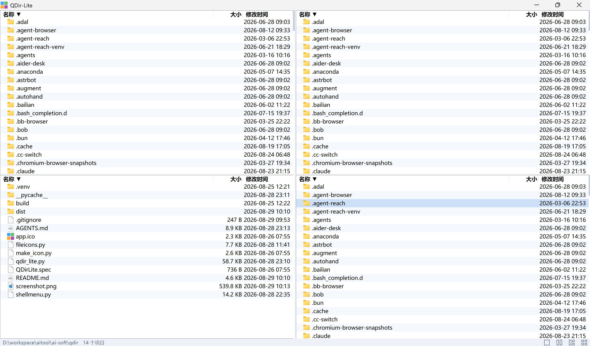

# QDir-Lite

一个极简的多窗格（1~4）Windows 文件管理器。

**快捷键**：
  - `Backspace` 返回上级
  - `Alt+←/→` 历史后退/前进（每窗格独立，浏览器式）
  - `Ctrl+左键` 唤出隐藏的标题栏和地址栏（输入路径回车跳转，Esc 收起）
  - 地址栏 `↓` / `F4` / `Alt+↓` 展开历史下拉，键入即过滤，点选或回车直接跳转
  - `Ctrl+C/X/V` 复制/剪切/粘贴（系统剪贴板，与资源管理器互通）
  - `Ctrl+A` 全选，`Delete` 删除（支持多选）
  - `Ctrl+E` / 双击状态栏路径：在资源管理器中打开当前目录

**核心亮点：**

- **极简到没有"设置"**——没有菜单栏、没有工具栏、没有选项界面，整个窗口就是几个文件列表 + 一条状态栏
- **单文件运行**——整个程序就是一个 `QDirLite.exe`（约 11MB），**不需要装 Python**，不写注册表，拷到任何 Windows 电脑上双击即用
- **零第三方依赖**——纯 Python + tkinter + Win32 ctypes 实现，文件图标、右键菜单全部直接调系统 API
- **和系统无缝互通**——右键菜单是系统原生 Shell 菜单（7-Zip 等第三方扩展一个不少），复制粘贴走系统剪贴板，和资源管理器直接互操作

## 截图



## 为什么要做这个项目

Windows 自带资源管理器只支持单窗口单视图，想对照两个目录、批量搬文件就得开好几个窗口来回拖。老牌的多窗格工具（如 Q-Dir）功能强大，但界面堆满了按钮、菜单和选项，对"只想安安静静分几个栏看文件"的人来说太重了。

QDir-Lite 的想法是：**保留 Q-Dir 多窗格这一个核心价值，把其他一切砍到最少**。

它更像一个"窗口布局工具"而不是"文件管理器"——文件操作全部委托给系统，它只负责把目录排成你想要的样子。

## 和 Q-Dir 的对比

| | Q-Dir | QDir-Lite |
|---|---|---|
| 窗格数量 | 1~4，多种排布 | 1~4，2x2 网格内的几种划分 |
| 界面元素 | 菜单栏 + 工具栏 + 地址栏 + 树面板等 | 只有文件列表和状态栏 |
| 设置项 | 大量（颜色、字体、行为…） | 无 |
| 右键菜单 | 自带 + 系统菜单 | 纯系统原生菜单（含第三方扩展） |
| 与资源管理器互通 | 支持拖放 | 复制/剪切/粘贴走系统剪贴板 |
| 实现 / 体积 | C/C++，~1MB | Python 单文件 exe，~11MB |
| 适合谁 | 需要全能文件管理器的用户 | 只想要"分栏看文件"的用户 |

一句话：Q-Dir 是瑞士军刀，QDir-Lite 只留其中一片刀刃。

## 功能

- **1/2/3/4 窗格布局切换**：状态栏右端的示意按钮，一键重排，窗格间分隔条可拖拽
- **原生右键菜单**：完整系统 Shell 菜单，包含"新建"子菜单、第三方扩展、"在终端中打开"
- **系统剪贴板互通**：Ctrl+C/X/V，和资源管理器、其他程序之间直接复制粘贴文件；粘贴重名自动 `name (2).ext`
- **框选**：按住左键拖出矩形选框（配合 Ctrl 追加选择）
- **行内重命名**：慢双击或右键"重命名"，新建文件/文件夹后自动进入改名
- **浏览历史**：每窗格独立的后退/前进栈（Alt+←/→）；地址栏右端 ▾ 展开历史下拉，和资源管理器一样点选即切换，键入实时过滤
- **系统图标**：和资源管理器完全一致的文件图标，后台异步加载不卡界面
- **外部改动自动刷新**：目录内容被其他程序修改后 2 秒内自动更新
- **便携**：窗口位置、各窗格目录、浏览历史、布局自动记忆，存在程序旁的 `qdir_lite_state.json`

## 下载与运行

从 Releases 下载 `QDirLite.exe`，双击即可运行。**不需要安装 Python，不需要管理员权限**，不写注册表。

注意：exe 只支持 Windows 10/11（64 位）。

## 自己构建

```bash
# 语法检查
python -m py_compile qdir_lite.py fileicons.py

# 打包（PyInstaller 6.x，单文件、无控制台）
pyinstaller QDirLite.spec --noconfirm --clean

# 产物
dist/QDirLite.exe
```

项目结构：

```
qdir_lite.py    主程序（界面、交互、文件操作）
fileicons.py    系统图标获取（SHGetFileInfoW → PhotoImage，后台线程）
shellmenu.py    原生 Shell 右键菜单（IContextMenu/IContextMenu2）
make_icon.py    生成 app.ico（纯标准库绘制，仅改图标时需重跑）
QDirLite.spec   PyInstaller 打包配置
```

## 技术要点（踩坑记录）

这个项目坚持零第三方依赖，所有"轮子"都用 Win32 ctypes 自己造，过程中踩了不少坑，完整的记录在 [AGENTS.md](AGENTS.md) 里，挑几个有意思的：

- `SHGetFileInfoW` 必须带真实路径调用才能拿到和资源管理器一致的图标
- HICON 转 PNG 时读出的 BGRA 是**预乘 alpha**，不做反预乘透明边缘会发黑
- 子菜单文字空白 = 忘了给 `IContextMenu2::HandleMenuMsg` 转发菜单消息
- 目录空白处的"新建"子菜单需要把背景菜单拆出来合并进项目菜单
- ctypes 调返回句柄的 Win32 API 必须显式声明 `restype`，否则 64 位下句柄被截断

## 许可证

MIT
